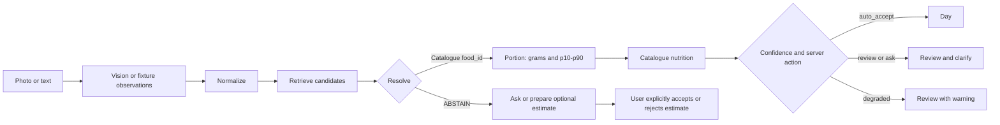

# mealog — accuracy-first mobile meal logging

mealog is a React Native meal logger backed by a Node.js/TypeScript service. It
turns a photo or informal text into canonical foods, explicit portion ranges,
and catalogue-backed nutrition. When the system cannot support a safe match, it
asks or abstains instead of silently logging its nearest guess.

The implementation follows a hybrid path: Gemini or a deterministic fixture
extracts observations; pure TypeScript stages normalize, retrieve, resolve,
estimate portions, compute nutrition, and route the result. A separate LLM
estimate endpoint exists only after a catalogue miss. Its output is labelled
unverified, carries ranges and assumptions, is never auto-accepted, requires
user acceptance before save, and is excluded from grounded evaluation.

> [!IMPORTANT]
> **Submission state:** the app, Node service, offline evaluation, technical
> write-up, email draft, and [9:07 Loom walkthrough](https://www.loom.com/share/8a1ad6fea24e401eaf52788d72d5a0fd)
> are present. Recipient access to the recording must be verified before sending.
> GitHub-hosted jobs remain blocked before execution by the account's
> billing/spending state. The unchanged gates passed in a private-repository
> [temporary self-hosted Actions run](https://github.com/zexy2/mealog-case-study/actions/runs/32878391604);
> that result is not presented as GitHub-hosted-runner evidence.

## Reviewer guide

| If you have... | Start here |
| --- | --- |
| 2 minutes | [Product and measured result](#product-and-measured-result), then [EatBetter comparison](#compared-with-eatbetter) |
| 5 minutes | [Architecture](#architecture), [Known failures](#known-failures-measured), and [Trade-offs](#key-trade-offs) |
| 10 minutes | Run the [keyless mobile demo](#1-keyless-mobile-demo), then inspect [evaluation](docs/evaluation.md) and [decisions](docs/decisions.md) |
| Walkthrough | [9:07 Loom recording](https://www.loom.com/share/8a1ad6fea24e401eaf52788d72d5a0fd) and [timed script](docs/walkthrough.md) |

Deep dives: [architecture](docs/architecture.md), [evaluation](docs/evaluation.md),
[EatBetter comparison](docs/comparison.md), [decisions D1–D20](docs/decisions.md),
and [bounded HITL/data-flywheel design](docs/data_flywheel_and_hitl_architecture.md).

## Data licensing and attribution

This repository is published as a noncommercial case-study and information-
sharing project. Its software and third-party nutrition data do not share one
blanket licence. See [THIRD_PARTY_DATA.md](THIRD_PARTY_DATA.md) before copying,
redistributing, or using any locale pack.

The Turkish pack contains selected nutrition values attributed as required:
[TürKomp, Ulusal Gıda Kompozisyon Veri Tabanı, versiyon 1.0](https://turkomp.tarimorman.gov.tr/).
Its [official data-use conditions](https://turkomp.tarimorman.gov.tr/useofdata)
permit conditioned noncommercial information sharing; commercial use requires
a separate agreement with the authorised institution. Project `food_id` values,
display labels, aliases, serving defaults, density annotations, and confidence
logic are mealog metadata, not official TürKomp fields.

The Japanese pack is separately attributed to MEXT. Its source and remaining
licence boundary are recorded in [THIRD_PARTY_DATA.md](THIRD_PARTY_DATA.md) and
next to the pack. No third-party dataset is relicensed by this repository.

## Product and measured result

The mobile experience has four deliberate outcomes:

- `auto_accept` goes to Day with the new record highlighted and undo available.
- `review` or `ask` opens an audit view with candidates, identity confidence,
  source, quantity, and a visible p10–p90 portion band.
- `ABSTAIN` explains that no safe catalogue match exists and offers correction,
  note, or explicitly unverified estimate paths.
- degraded/provider failures never appear as first-class accepted answers.

The current offline V3 replay uses **80 recorded, non-synthetic provider
responses** and matching labels. Its primary result is the risk–coverage trade:
**10/80 meals commit (12% coverage), 70/80 ask, Item F1 is 0.15, and FP rate is
86.0%**. Calorie MAPE is **12.7% over only 2/2 complete, covered calorie rows**;
that denominator is too small for a broad accuracy claim.

| Cuisine | n | Coverage | Item F1 | kcal MAPE | FP rate |
| --- | ---: | ---: | ---: | ---: | ---: |
| western | 12 | 33% | 0.43 | 12.7% (2 rows) | 66.7% |
| mediterranean | 12 | 25% | 0.22 | — | 71.4% |
| east_asian | 16 | 6% | 0.10 | — | 90.0% |
| other_mixed | 8 | 0% | 0.08 | — | 91.7% |
| south_asian | 16 | 0% | 0.00 | — | 100.0% |
| latin_american | 16 | 12% | 0.06 | — | 95.7% |
| **overall** | **80** | **12%** | **0.15** | **12.7% (2 rows)** | **86.0%** |

An em dash means no covered, complete-positive calorie row—not zero error.
These are reproducible fixture-replay results, not live-provider accuracy. The
fixtures were recorded with `gemini-flash-lite-latest`; they do not measure the
current live adapter default, `gemini-3.6-flash`.

## Compared with EatBetter

This comparison is bounded to mealog's demonstrated behavior and EatBetter's
public App Store positioning and observed public product surfaces. It makes no
claim about EatBetter's internal model, catalogue, thresholds, storage, or
retry architecture.

| What is better | Why | How measured | Concrete example or failure |
| --- | --- | --- | --- |
| Closed-set `food_id` or `ABSTAIN` | Prevents invented output IDs from becoming authoritative nutrition; it does not prevent perception or wrong-match errors | 145 retrieval variants; 122/122 positive Recall@1 and 0/22 absent-food false accepts | `baked beans` must not become `tr.kuru_fasulye` |
| Visible abstention | A wrong complete-looking log is harder to notice than a deferral | V3 reports coverage beside errors: 10/80 commit, 70/80 ask | `jp_0002` returns three abstentions for foods absent from `ja_JP` |
| p10–p90 portion uncertainty | Portion error directly changes calorie error | Portion tests cover count, density, label serving, fallback, and provenance | Packaged yogurt shows 170 g with a 153–187 g band and label provenance |
| Worst-cuisine reporting | A mean can hide a market that is unusable | Every cuisine reports n, coverage, Item F1, MAPE, and FP rate | South Asian: n=16, 0% coverage, Item F1 0.00 |
| Auditable result | Identity, alternatives, confidence, grams, source, and provenance can be challenged before save | Typed response contract plus focused API/mobile tests | Review exposes canonical ID, ranked candidates, portion source, and uncertainty |
| User-scoped idempotency | Retries do not duplicate one user's meal or collide across users | E2E tests replay the same key and reuse it across two users | Same user/key replays one result; another user executes independently |
| Licence enforcement | Nutrition data rights are checked at pack load, not documented after calculation | 103/103 food rows have a source; all 3 packs declare a licence | Commercial mode rejects a restricted pack |
| **EatBetter: catalogue and long-tail breadth** | mealog's safety boundary creates correction friction outside 103 foods | mealog measures its own catalogue and abstention; an equivalent public EatBetter count is unavailable | Turkish pack misses common long-tail dishes; honest abstention is safe but not broad |

Full evidence and caveats: [docs/comparison.md](docs/comparison.md). This does
not establish that mealog beats EatBetter overall.

## What was delivered

| Brief requirement | State | Evidence |
| --- | --- | --- |
| Mobile app, not web | Delivered; historical local smoke only | Expo React Native Capture, Review, Abstention, and Day flows; earlier simulator logs exist, but no current-release physical-device or simulator E2E claim |
| Node.js / TypeScript backend | Delivered | NestJS edge and framework-free TypeScript pipeline core |
| Hybrid AI path | Delivered | Vision adapter + deterministic normalization/retrieval/resolution/portion/nutrition + confidence routing |
| Accuracy evaluation | Delivered | 80-sample offline replay, cuisine/tier slices, error taxonomy, regression gate |
| Technical write-up | Delivered | README and linked architecture/evaluation/decision documents |
| EatBetter comparison | Delivered | Concise table above and full evidence document |
| Loom walkthrough | Delivered | [9:07 recording](https://www.loom.com/share/8a1ad6fea24e401eaf52788d72d5a0fd) and [timed script](docs/walkthrough.md); recipient access must still be checked |
| Email summary | Ready after access check | [docs/submission_email_draft.md](docs/submission_email_draft.md) |

## Run locally

Requirements: Node.js 22.x. Python 3.11 is needed only for offline evaluation.
iOS runtime needs macOS, Xcode, and a bootable Simulator; Android runtime needs
Android Studio/emulator or a connected device.

```sh
git clone https://github.com/zexy2/mealog-case-study.git
cd mealog-case-study
node --version       # 22.x
python3.11 --version # required only for offline evaluation
```

### 1. Keyless mobile demo

This is the fastest product path. It uses deterministic local scenarios and
does **not** need the Node service, network access, or an API key.

```sh
cd apps/mobile
npm ci
npm run typecheck
npm test
EXPO_PUBLIC_DEMO_MODE=true npm run ios
```

Use `EXPO_PUBLIC_DEMO_MODE=true npm run android` for an available Android
emulator/device. These commands attempt runtime launch; bundle export is a
separate build check and is not device proof.

### 2. Keyless Node API smoke

Terminal 1:

```sh
cd server
npm ci
npm run build
VISION_PROVIDER=fixture PORT=3000 npm start
```

Terminal 2:

```sh
curl --fail --silent http://localhost:3000/health

curl --fail --silent \
  -H 'Content-Type: application/json' \
  -d '{
    "idempotency_key": "readme-quickstart-1",
    "sample_id": "tr_0001",
    "locale": "tr",
    "config": "V3"
  }' \
  http://localhost:3000/v1/meals
```

The fixture request should return HTTP 200, `action: "review"`, and a resolved
`tr.kuru_fasulye` item with an explicit portion band. If port 3000 is occupied,
use another `PORT` and the same port in both URLs.

### 3. Optional live Gemini integration

Live mode requires a server-side key; it is never placed in the mobile bundle.

```sh
# Terminal 1: server/
VISION_PROVIDER=gemini GEMINI_API_KEY='your-key' PORT=3000 npm start

# Terminal 2: apps/mobile/
EXPO_PUBLIC_DEMO_MODE=false \
EXPO_PUBLIC_API_URL=http://localhost:3000 \
npm run ios
```

For a physical phone, replace `localhost` with a service address reachable from
that phone. No live-provider accuracy claim is inferred from a successful run.

### 4. Full local verification

```sh
# Node service
cd server
npm ci
npm run build
npm run typecheck
npm run lint
npm test

# Mobile client
cd ../apps/mobile
npm ci
npm run typecheck
npm test
npx expo export --platform ios
npx expo export --platform android

# Offline Python/reference gates, from repository root
cd ../..
MEALOG_VENV="$(mktemp -d)/venv"
python3.11 -m venv "$MEALOG_VENV"
. "$MEALOG_VENV/bin/activate"
python -m pip install -e "server[dev]"
make check
```

The Expo exports prove bundling, not simulator/device execution. `make check`
is the offline Python/reference gate; it does not replace Node or mobile checks.

## Architecture



| Boundary | Guarantee |
| --- | --- |
| Vision port | Produces observations, not canonical IDs or grounded nutrient values |
| Resolver | Returns a candidate catalogue `food_id` or `ABSTAIN`; wrong perceptions and wrong in-catalogue matches remain possible |
| Portion stage | Uses evidence-graded catalogue serving, explicit unit/count, package label, or density inputs and preserves p10–p90 plus provenance |
| Grounded nutrition | Pure arithmetic over catalogue rows with declared source and licence status |
| Confidence gate | Routes on server action; mobile does not infer acceptance locally |
| Estimate lane | Separate endpoint, max 20 unresolved items, unverified label, automatic bounded preparation, explicit acceptance before save, excluded from grounded eval |

The HTTP API is NestJS/TypeScript. Python remains offline evaluation and
reference tooling, not the delivered backend. See [docs/architecture.md](docs/architecture.md)
for sequence diagrams and port boundaries.

## Reliability and observability

- Idempotency is scoped by `(user_id, idempotency_key)`; payload conflicts are
  rejected. Meal response cache is bounded to 5,000 entries and estimate cache
  to 500 entries.
- Provider failures use typed categories, retry metadata, degraded routing, and
  a client retry state instead of an opaque successful answer.
- The edge propagates `X-Request-Id`, emits structured JSON events, records
  request/outcome/stage timings in a bounded process-local registry, and exposes
  `/health` plus `/metrics`.
- Metrics, rate-limit, and idempotency state are process-local. Multi-instance
  production needs shared durable infrastructure.

## Key trade-offs

| Decision | Constraint gained | Cost paid |
| --- | --- | --- |
| Closed-set grounded nutrition ([D1](docs/decisions.md#d1)) | No silent authoritative nutrient number for an unknown identity | Low catalogue coverage and more user questions |
| Locale packs as data ([D2](docs/decisions.md#d2)) | New markets do not require pipeline branches; licence stays explicit | Pack curation and legal review grow per market |
| Worst-cuisine + coverage reporting ([D3](docs/decisions.md#d3)) | Distribution shift stays visible | Small buckets are noisy and harder to market |
| Expo mobile client ([D9](docs/decisions.md#d9)) | Real mobile flow rather than a format-violating web app | Simulator/device compatibility must be verified separately from export |
| NestJS edge + Python harness ([D12](docs/decisions.md#d12)) | Backend matches the required Node/TypeScript workflow while preserving reproducible evaluation | Two runtimes and parity ceremony |

## Known failures, measured

| Failure | Current behavior | User/product impact |
| --- | --- | --- |
| Occluded photographed counts | Two stacked simits become `quantity: null`, 100 g with a 65–145 g band, and a count question | Prevents silent undercount but adds review friction |
| Legume/soup near-neighbours | Some inputs still surface egg, bean, or soup neighbours; low confidence keeps them from silent commit | Proposed identity can still be wrong even when routing contains the damage |
| Thin Turkish catalogue | 57 rows; common dishes such as döner, poğaça, börek, pide, and kebap are absent | More `ask`/abstention and correction work |
| South Asian coverage | n=16, 0% coverage, Item F1 0.00 | The weakest market remains unusable in this evaluation set |

The earlier cooked/dry confusion is contained, not solved by new nutrition
rows: prepared pasta, bulgur, mantı, Turkish coffee, and tea probes now abstain
instead of selecting raw/dry records. See [docs/evaluation.md](docs/evaluation.md)
and the full [error taxonomy](docs/error_taxonomy.md).

## Security and privacy limits

- Uploads use MIME allow-listing, magic-byte checks, and a 10 MiB limit.
- JPEG, PNG, WebP, and GIF metadata is stripped in memory before provider use.
  HEIC/HEIF/AVIF are accepted but their metadata stripping is not shipped.
- Raw photos are not persisted by the service.
- Pixel-level face blurring exists as a tested standalone algorithm but is **not
  wired into live JPEG/PNG ingestion** and is not claimed as shipped protection.
- `X-User-Id` is a client-device scope for this case study, not authentication.
  Production needs signed identity, durable consent, retention, and deletion.
- API keys stay server-side. No key, `.env`, or user photo belongs in Git.

## Remaining limitations

- No public deployment URL and no current-release simulator or physical-device
  end-to-end claim. Existing simulator logs are historical smoke evidence.
- The 9:07 Loom walkthrough is linked, but recipient access still needs to be
  verified in a signed-out/private browser window before sending.
- GitHub-hosted Actions jobs execute zero steps because of account
  billing/spending state. The same workflow passed on a trusted temporary
  self-hosted Mac runner; this does not prove GitHub-hosted runner execution.
- Live-provider accuracy is unmeasured; the scorecard replays fixtures recorded
  with a different Gemini model than the current live adapter default.
- Only 2/80 rows are complete and covered for calorie MAPE.
- The mobile client carries a shadow nutrition/correction map and local matching
  rules, recomputes display totals, and can persist a locally corrected record
  when no server correction is produced. This is broader than preview-only
  arithmetic and weakens the intended server-authoritative D1 boundary.
- Current Expo transitive tooling reports npm audit advisories; the automatic
  remedy is a major SDK upgrade requiring a separate compatibility/device pass.

## Next three accuracy improvements

1. Expand licensed catalogue coverage where `ask` clusters, without tuning the
   golden set or hiding the risk–coverage cost.
2. Collect consented corrections through the bounded review queue, then measure
   before changing thresholds or training.
3. Improve multi-item segmentation and count evidence, then rerun the same
   cuisine/tier slices and adversarial false-accept controls.

## AI usage

AI coding tools assisted implementation, tests, review, and documentation.
Gemini is the live vision adapter and optional unverified estimate provider.
Human decisions define the closed-set boundary, provenance/licence rules,
evaluation labels, abstention policy, and merge gates.

A concrete model failure shaped the product: live probes treated two stacked
simits as one and cooked-food prefixes could lead toward dry catalogue records.
The response was not a stronger prompt claim. Count uncertainty now becomes an
explicit question, while known cooked/dry ambiguities abstain. Both behaviors
are covered by reproducible tests and remain visible as limitations rather than
being removed from the evaluation set.
