# mealog — Full Stack Developer take-home for EatBetter

mealog is a mobile-first meal logging case study. Its grounded pipeline maps
observations to a closed catalogue and computes nutrition deterministically. A
separate, explicitly unverified LLM-estimate lane is available only after a
catalogue miss and requires user acceptance.

> **Core Focus (AI Accuracy):** Converting noisy, ambiguous, multi-component dining photos and informal text into **verified canonical foods + explicit portion uncertainty intervals + catalogue-backed nutrition** ([Deep Dive in System Architecture](docs/architecture.md#3-robustness-to-messy-real-world-inputs--ambiguity-core-ai-focus)).

* **System Architecture & Design:** [docs/architecture.md](docs/architecture.md)
* **Architecture Decisions:** [docs/decisions.md](docs/decisions.md) (D1–D20)
* **EatBetter Comparison & Benchmark:** [docs/comparison.md](docs/comparison.md)
* **Correction Telemetry & Proposed HITL Loop:** [docs/data_flywheel_and_hitl_architecture.md](docs/data_flywheel_and_hitl_architecture.md)
* **Walkthrough Script:** [docs/walkthrough.md](docs/walkthrough.md)


## Run it

Runtime versions are pinned by the project workflow: Python 3.11 for the offline research harness and Node.js 22 for the delivered TypeScript service and mobile app.

### Delivered Node.js service

The NestJS service defaults to the keyless fixture provider. From the repository root:

```sh
cd server
npm ci
npm run build
npm run lint
npm run test
npm start
```

In another terminal, liveness is available at `http://localhost:3000/health`.
If port 3000 is occupied, start with `PORT=4310 npm start` and use the same port
in the mobile API URL.
`VISION_PROVIDER=gemini` selects the live Gemini adapter and requires
`GEMINI_API_KEY`; no live-provider accuracy claim is made here.

### Mobile app

From the repository root:

```sh
cd apps/mobile
npm ci
npm run typecheck
npm test
npx expo export --platform ios
npx expo export --platform android
```

The keyless reviewer path is the default. Launch it with `npm run ios` when a
local simulator is configured; it uses deterministic local scenarios and makes
no network request. Live mode is an explicit opt-in:

```sh
EXPO_PUBLIC_DEMO_MODE=false \
EXPO_PUBLIC_API_URL=http://localhost:3000 \
npm run ios
```

For a physical phone, replace `localhost` with a Node service address reachable
from that phone. `apps/mobile/.env.example` records both modes without a secret.
Session logs document current demo-mode iOS Simulator execution
([log/2026-08-24-1755-codex3-demo-review-fixture-alignment.md](log/2026-08-24-1755-codex3-demo-review-fixture-alignment.md)); repository CI proves TypeScript typecheck and iOS/Android bundle exports.
Fixture-backed multi-item pipeline behavior is covered by
[server/test/messy_real_inputs.test.ts](server/test/messy_real_inputs.test.ts).
A separate live-provider iOS Simulator retest is recorded in
[log/2026-08-22-1434-codex3-live-gallery-pr184-retest.md](log/2026-08-22-1434-codex3-live-gallery-pr184-retest.md).
Neither is physical-device deployment evidence.

The mobile client is deterministic demo mode unless
`EXPO_PUBLIC_DEMO_MODE=false` is supplied. Demo mode uses local scenarios and
no network. Live mode calls `POST /v1/meals`; `EXPO_PUBLIC_API_URL` selects the
reachable Node service and otherwise falls back to the simulator-local default.

### Offline evaluation and reference tooling

This path is keyless. It replays repository fixtures from `eval/fixtures/`
against locale and golden-set data; no provider token or network call is
required. From the repository root:

```sh
MEALOG_VENV="$(mktemp -d)/venv"
python3.11 -m venv "$MEALOG_VENV"
. "$MEALOG_VENV/bin/activate"
python -m pip install -e "server[dev]"
make check
```

`make eval` runs the offline evaluation harness directly when a scorecard
refresh is needed. Python remains evaluation/reference tooling, not the
delivered HTTP API.

## What I built vs the brief

| Brief requirement | Status | Evidence or reason |
| --- | --- | --- |
| Mobile app, not a web app | Delivered; runtime evidence is local | React Native Expo client with Capture, Review, Day, and Abstention screens; interactive candidate selection and server-side EXIF stripping. Session logs record demo and live-provider iOS Simulator runs, but their temporary screenshots are not portable repository evidence. Local checks prove typecheck and bundle export, not device execution. |
| Node.js / TypeScript backend | Delivered | NestJS edge, vision adapters (Gemini + Fixture), runner, retrieval seam, portion gate, rate limiter, privacy filter, and 313 tests passing across 26 files. |
| Technical write-up | Delivered | Comprehensive architecture documentation across README.md, [docs/decisions.md](docs/decisions.md) (D1–D20), and [docs/comparison.md](docs/comparison.md). |
| Walkthrough video | Pending recording | Timed 5–10 minute script is ready in [docs/walkthrough.md](docs/walkthrough.md); no Loom URL is claimed until the recording exists. |
| Email summary | Draft ready | [Submission email draft](docs/submission_email_draft.md) is prepared but must receive the recorded Loom URL before sending. |
| Explicit EatBetter comparison | Delivered | Evidence-backed comparison and benchmark report documented in [docs/comparison.md](docs/comparison.md). |
| AI / LLM path | Delivered | Hybrid rules + retrieval + LLM approach with closed-set grounded nutrition, confidence routing, and a separately labelled unverified estimate fallback for catalogue misses. |


## Architecture

```mermaid
flowchart LR
    subgraph Ingress[" 📸 Ingress Layer "]
        A["🍽️ Photo or Text\n(Multi-item Input)"] --> B["🔍 Perception\n(Gemini / Fixture)"]
    end

    subgraph CorePipeline[" ⚙️ Pure TypeScript Deterministic Pipeline "]
        B --> C["🔤 Normalize\n(Diacritics & Units)"]
        C --> D["🔎 Retrieval\n(TF-IDF N-grams)"]
        D --> E["🎯 Resolution\n(Closed-Set ID / ABSTAIN)"]
        E --> F["⚖️ Portion\n(p10–p90 Band)"]
        F --> G["🧪 Grounded Nutrition\n(TÜRKOMP / USDA)"]
    end

    subgraph TrustGate[" 🛡️ Trust & Routing Gate "]
        G --> H{"🚦 Confidence Gate\n(Effective score ≥ 0.75?)"}
        H -->|"High Confidence"| I["✅ Commit (Day)"]
        H -->|"Ambiguous / Occluded"| J["⚠️ Review / Clarify"]
        H -->|"Out of Catalogue"| K["🛑 Safe ABSTAIN"]
        K -.->|"Explicit user acceptance"| L["⚠️ Optional LLM Estimate\nUnverified, range + assumptions"]
    end

    style Ingress fill:#1e293b,stroke:#3b82f6,stroke-width:2px,color:#fff
    style CorePipeline fill:#0f172a,stroke:#10b981,stroke-width:2px,color:#fff
    style TrustGate fill:#1e1e2e,stroke:#f59e0b,stroke-width:2px,color:#fff
    style G fill:#064e3b,stroke:#10b981,stroke-width:2px,color:#a7f3d0
    style I fill:#064e3b,stroke:#22c55e,stroke-width:1px,color:#bbf7d0
    style J fill:#78350f,stroke:#f59e0b,stroke-width:1px,color:#fef3c7
    style K fill:#7f1d1d,stroke:#ef4444,stroke-width:1px,color:#fecaca
    style L fill:#78350f,stroke:#f59e0b,stroke-width:1px,color:#fef3c7
```



### Pipeline Stages & Guarantees

| Stage | Responsibility | Boundary & Invariant Guarantee |
|---|---|---|
| **1. Perception** | Visual extraction & multi-item disaggregation | Grounded `VisionPort` returns candidate text observations and count evidence; it does not return nutrient numbers. |
| **2. Normalize** | Text, diacritic, and unit cleaning | Normalizes Turkish/Japanese characters and converts colloquial measures (`"2 dilim"` $\rightarrow$ `slice`). |
| **3. Retrieval** | Candidate proposal via in-house TF-IDF | Word 1–2 & Char 3–5 n-grams scored as IDF-weighted asymmetric coverage over canonical documents. |
| **4. Resolution** | Closed-set ID mapping or safe abstention | Returns only a verified catalogue `food_id` or `ABSTAIN` (eliminates free-text LLM hallucination). |
| **5. Portion** | Serving mass estimation with uncertainty | Computes `(grams, p10, p90)` interval based on physical food density and visual item count. |
| **6. Nutrition** | Pure deterministic nutrient arithmetic | **D1 server invariant:** The only grounded server stage allowed to compute calories/macros from verified laboratory rows. |
| **7. Decision Gate** | Multi-factor confidence routing | Routes entries to `auto_accept` ($\ge 0.75$ effective confidence), `review` (uncertain portion/food), or `ask` (safe deferral; `ABSTAIN` is one possible identity outcome). |

The grounded path above uses an effective auto-accept threshold of `0.75` and
keeps catalogue nutrition authoritative. After `ABSTAIN`, D19/D20 permit a
separate `POST /v1/meals/estimate` request for up to 20 unresolved items. That
response is labelled `llm_unverified_estimate`, carries ranges and assumptions,
is never auto-accepted, and is excluded from grounded evaluation.

> [!NOTE]
> **Runtime Separation:** The delivered API implementation is **Node.js / TypeScript (NestJS Edge)** with framework-free pure core pipeline logic. Python remains dedicated **offline research, fixture generation, and regression testing tooling** (`eval/harness.py`). No production deployment is claimed.
>
> 📖 *For comprehensive sequence diagrams, privacy sanitization flows, and the bounded correction telemetry design, see the [System Architecture Specification](docs/architecture.md).*

## Key decisions

| Decision | Rejected alternative | Constraint | Cost |
| --- | --- | --- | --- |
| [D1](docs/decisions.md#d1), superseded narrowly by [D19](docs/decisions.md#d19) / [D20](docs/decisions.md#d20) | Silently treat model calories as grounded truth | Grounded nutrition remains catalogue-backed; optional model estimates are unverified, bounded, explicit, and excluded from eval | Catalogue misses either lose coverage or require a visibly weaker estimate lane |
| [D2](docs/decisions.md#d2) — locale data lives in packs | Add market-specific branches to pipeline code | Market variation must remain data, with pack licensing visible | Pack maintenance and legal review grow with markets |
| [D3](docs/decisions.md#d3) — report worst-case cuisine and coverage | Report only an overall mean | Distribution shift must stay visible to reviewers | Small buckets remain noisy and harder to summarize |
| [D9](docs/decisions.md#d9) — Expo React Native client with focused screens | Ship a web app or a different mobile stack | Reviewer path must be a real phone flow | Expo and native runtime constraints remain |
| [D12](docs/decisions.md#d12) — NestJS edge, TypeScript service, Python harness | Rewrite evaluation before parity or keep Python at the edge | Pure-core parity gates the port; Python stays research tooling | Two runtimes create temporary maintenance and release ceremony |

## Results

Current offline V3 replay from `docs/evaluation.md` covers all **80** committed
samples. Overall coverage is **12% (10/80 committed, 70/80 ask)**, Item F1 is **0.15**, FP rate is
**86.0%**, and kcal MAPE is **12.7%**. MAPE is computed over **2/2**
calorie-eligible/scored rows; `eligible` means complete positive-truth rows and
`scored` means the covered subset. An em dash means an empty calorie denominator,
not zero-percent error.

| Cuisine | n | Coverage | Eligible/scored | Item F1 | kcal MAPE | FP rate |
| --- | ---: | ---: | ---: | ---: | ---: | ---: |
| western | 12 | 33% | 2/2 | 0.43 | 12.7% | 66.7% |
| mediterranean | 12 | 25% | 0/0 | 0.22 | — | 71.4% |
| east_asian | 16 | 6% | 0/0 | 0.10 | — | 90.0% |
| other_mixed | 8 | 0% | 0/0 | 0.08 | — | 91.7% |
| south_asian | 16 | 0% | 0/0 | 0.00 | — | 100.0% |
| latin_american | 16 | 12% | 0/0 | 0.06 | — | 95.7% |
| **overall** | **80** | **12%** | **2/2** | **0.15** | **12.7%** | **86.0%** |

Measured repository inventory: **3 locale packs**, **103 canonical foods** (en_US 38, tr 57, ja_JP 8), and
**80 recorded golden-set fixtures**. These are offline evaluation facts, not
live-provider performance.

## Known failures, measured

Every failure below is reproduced, not suspected. Figures come from the offline
scorecard, a live verification run on `acfa6dd` (2026-08-23, 12 requests, all
HTTP 200), and a 21-request catalogue audit (2026-08-22). Verified behaviour is
recorded under Results and Testing; this section is deliberately only the
failures.

| Failure | Evidence | Effect | Tracked |
|---|---|---|---|
| A photographed count is occluded or uncertain | `A2.jpg` shows two stacked simits. The service flags occlusion, returning `quantity: null`, 100 g standard portion with 65–145 g uncertainty band (214–478 kcal), and routes to Review with a count clarification question ('Kaç adet?'). | Prevents silent undercounting by gating Day save on user count confirmation. | [#218](https://github.com/zexy2/mealog-case-study/issues/218) |
| Legumes and soups still expose wrong near-neighbours | A current deterministic probe sends `haşlanmış mercimek` and `haşlanmış fasulye` to the egg record, `nohut yemeği` to `tr.kuru_fasulye`, and `tarhana çorbası` to `tr.mercimek_corbasi`. Their low effective confidence routes them away from silent commit, but the proposed identity is still wrong. | Review/ask contains the damage, but the correction burden remains with the user. This is retrieval/catalogue quality rather than calorie arithmetic. | Open, untracked |
| The Turkish catalogue is thin for the default locale | `locale_packs/tr/foods.jsonl` holds 57 rows, including `tr.kofte_izgara`, but no entry for döner, poğaça, börek, pide, or kebap. | Unsupported or uncertain samples contribute to the measured 70/80 `ask` outcomes rather than being silently committed. `ask` is broader than explicit `ABSTAIN`. | Open, untracked |
| South Asian cuisine is unrepresented | 16 samples, 0% coverage, Item F1 0.00, FP rate 100%. | The golden set was deliberately not narrowed to fit the catalogue, so this bucket reports honestly instead of being excluded. | Open, untracked |

The false-positive rate (86.0%) is measured over the identity set and counts rejected
samples as well; 64.4% of false positives stem from unmapped recipe ingredients
(e.g., olive oil `us.olive_oil`) in multi-dish references. 70 of 80 samples ended in
`ask` and none of them were saved to Day.

The earlier cooked/dry defect is no longer listed as active: #219/#226 added
narrow negative aliases. Current probes for cooked pasta, bulgur, mantı,
ezogelin, kadayıf, prepared Turkish coffee, and brewed tea return `ABSTAIN`
instead of selecting dry/raw nutrition. This improves safety by reducing
coverage; it does not add the missing cooked catalogue rows.

## Compare EatBetter

EatBetter comparison is complete and stays short and evidence-led: product
behavior, workflow, and explicit trade-offs belong in the dedicated
[comparison document](docs/comparison.md), not in a marketing paragraph here.

## Testing

`make test` covers the Python reference behavior, locale-pack integrity,
closed-set resolution, pipeline contracts, and replay safety. `make lint`,
`python scripts/check_invariants.py`, and `python scripts/status.py --check`
cover static and repository-level constraints. `make check` combines these
checks with the offline regression gate.

The TypeScript service has separate build, lint, and test commands. Its focused
tests protect port parity and keep framework code at the edge. The mobile job
typechecks the Expo client and creates an Android bundle. GitHub Actions is
configured to run these gates, but the latest hosted jobs did not start because
the repository account's billing/spending limit blocked all steps; local green
checks are not presented as hosted-CI evidence.

## Security and privacy limits

- `X-User-Id` is a client-device scoped header (persisted in AsyncStorage) for
  isolating idempotency, rate limiting (30 req/min), and meal/estimate-cache
  deletion in this case study. Persisted telemetry omits that identifier and
  cannot currently be selected for per-user deletion. Production deployment
  requires signed authentication and owned telemetry retention/deletion semantics.
- Idempotency state is process-local in memory with LRU eviction (5,000 max entries).
- Image uploads use an allow-list, magic byte verification, and a 10 MiB limit.
  The edge scrubs EXIF/GPS metadata (`sanitizeImageBuffer()`), redacts PII text,
  and maintains zero persistent photo retention. Standalone pixel face blurring
  (`blurFacesInPixelArray`) is decoupled to keep edge execution lightweight.

## Known limitations

- No deployment URL is published.
- Hosted CI is currently blocked before step execution by the GitHub account's
  billing/spending state. This must be cleared and rerun before submission.
- The mobile Review preview duplicates a small Turkish nutrition map and
  recalculates preview totals after local edits. That is presentation-layer
  arithmetic, not the grounded server pipeline, but it weakens the single-source
  boundary and should be replaced by server correction responses.
- Live-provider accuracy is unmeasured; the scorecard replays recorded
  fixtures offline.
- Current demo and live-provider flows have iOS Simulator evidence; iOS and
  Android bundle exports pass. An earlier SDK 54 compatibility smoke opened the
  shell and camera in Expo Go on a physical iPhone, but it is not current-flow
  physical-device E2E evidence.
- Expo SDK 54 passes `expo-doctor`, typecheck, tests, and bundle export, but its
  current transitive Metro/tooling tree reports npm audit advisories. The
  available automatic fix is a major Expo SDK upgrade, which requires a
  separate compatibility and device-validation pass rather than a forced
  lockfile rewrite before submission.
- The 80-sample scorecard has 2/2 calorie-eligible/scored rows; other rows
  are partial or zero-truth for calorie evaluation.
- Reproduced accuracy defects, including photographed-count ambiguity, are
  listed with their evidence under [Known failures, measured](#known-failures-measured).

## With more time

- Rehearse and record the live mobile-to-Node path, then publish a deployment
  URL only after external proof exists.
- Record the complete walkthrough from the merged script with exact review and
  abstention states.
- Add authenticated OAuth identity, distributed/shared rate limiting (Redis/token-bucket tier across multi-instance edge), durable PostgreSQL idempotency, and explicit consent/deletion controls before treating the service as production-ready.
- Follow the [D8](docs/decisions.md#d8) training plan only after data provenance
  and evaluation gates are ready. D8 is a specified, measured path, not
  permission to tune against a headline.

## AI usage

Human decisions define the closed-set boundary, provenance rules, locale-pack
structure, abstention behavior, and evaluation gates. Models assist with
implementation and review, but their suggestions are overridden when they
conflict with those constraints.

### Concrete Model Error and Human Override

* **Model Error:** Earlier probes treated two stacked simits as one and stripped cooking prefixes from inputs such as `"haşlanmış makarna"`, allowing dry-food nutrition to look plausible.
* **How it was caught:** Live count verification plus adversarial cooked-form probes and regression tests made both failures reproducible.
* **Human Override:** Occluded count-one observations become `count: null` with an explicit question, while narrow negative aliases force known raw/cooked ambiguities to `ABSTAIN`. Neither correction is presented as broad visual accuracy.
