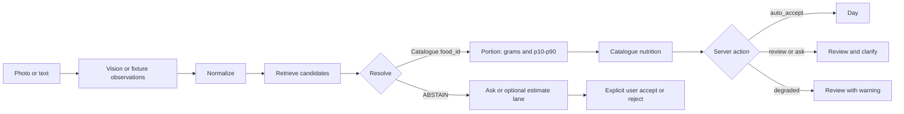

# Mealog — accuracy-first mobile meal logging

[](https://github.com/zexy2/mealog-case-study/actions/workflows/ci.yml)

Mealog is a React Native meal logger backed by a NestJS/TypeScript service. It
turns a photo or informal text into canonical foods, explicit portion ranges,
and catalogue-backed nutrition. When evidence is insufficient, it asks or
abstains instead of silently saving the nearest guess.

**Submission:** [9:07 Loom walkthrough](https://www.loom.com/share/8a1ad6fea24e401eaf52788d72d5a0fd)
· [Run locally](#run-locally) · [Evaluation](docs/evaluation.md) ·
[EatBetter comparison](docs/comparison.md) · [Architecture](docs/architecture.md)

## Product thesis

Most meal loggers optimize for a complete-looking answer. Mealog optimizes for
knowing when that answer is unsupported:

- **Closed-set identity:** grounded nutrition requires a catalogue `food_id`;
  otherwise resolution returns `ABSTAIN`.
- **Visible uncertainty:** portions are shown as grams plus p10–p90, with source
  and provenance—not as a hidden point estimate.
- **Human control:** server actions route a result to Day, Review, abstention,
  or retry. The mobile client does not infer acceptance locally.

The implementation uses a hybrid path: Gemini (or a deterministic fixture)
extracts observations; pure TypeScript stages normalize, retrieve, resolve,
estimate portions, compute grounded nutrition, and route the result. A separate
LLM estimate lane exists only after a catalogue miss. Its output is labelled
unverified, carries ranges and assumptions, is never auto-accepted, requires
explicit user acceptance, and is excluded from grounded evaluation.

## Evidence snapshot

The current offline V3 replay uses **80 recorded, non-synthetic provider
responses** and matching labels:

- **10/80 commit, 70/80 ask:** 12% grounded coverage.
- **Item F1 0.15; FP rate 86.0%:** the current identity layer is not accurate
  enough for broad automatic logging.
- **Calorie MAPE 12.7% on 2/2 rows:** too small a denominator for a general
  calorie-accuracy claim.
- **Hosted CI green:** [main run #32884235704](https://github.com/zexy2/mealog-case-study/actions/runs/32884235704)
  passed server, mobile, offline evaluation, invariant, status, and history
  gates on GitHub-hosted runners.

`ask` is a safe routing outcome, not a claim that every deferred candidate was
correct. The FP metric includes unsupported proposed items even when the system
defers them; it is not an 86% silent-commit rate. These are fixture-replay
results, not live-provider accuracy. The fixtures were recorded with
`gemini-flash-lite-latest`; they do not measure the live adapter default,
`gemini-3.6-flash`. Full cuisine slices, denominators, metric definitions, and
error taxonomy are in [docs/evaluation.md](docs/evaluation.md).

For a fast review, read the result and comparison, then run the keyless demo.
Deep dives: [architecture](docs/architecture.md), [evaluation](docs/evaluation.md),
[decisions D1–D20](docs/decisions.md), and the
[bounded HITL/data-flywheel design](docs/data_flywheel_and_hitl_architecture.md).

## Compared with EatBetter

This is an observed-product comparison, not a controlled accuracy benchmark.
It is limited to Mealog's demonstrated behavior and EatBetter's public
positioning and observed public product surfaces. It makes no claim about
EatBetter's internal model, catalogue, thresholds, storage, or retry design.

| What is better | Why | How measured | Concrete example or failure |
| --- | --- | --- | --- |
| Closed-set `food_id` or `ABSTAIN` | Prevents invented IDs from becoming authoritative nutrition; it does not prevent perception or wrong-match errors | 145 retrieval variants; 122/122 positive Recall@1 and 0/22 absent-food false accepts | `baked beans` must not become `tr.kuru_fasulye` |
| Visible abstention | A wrong complete-looking log is harder to notice than a deferral | V3 reports coverage beside errors: 10/80 commit, 70/80 ask | `jp_0002` returns three abstentions for foods absent from `ja_JP` |
| p10–p90 portion uncertainty | Portion error directly changes calorie error | Portion tests cover count, density, label serving, fallback, and provenance | Packaged yogurt shows 170 g with a 153–187 g band and label provenance |
| Worst-cuisine reporting | A mean can hide an unusable market | Every cuisine reports n, coverage, Item F1, MAPE, and FP rate | South Asian: n=16, 0% coverage, Item F1 0.00 |
| Auditable result | Identity, alternatives, confidence, grams, source, and provenance can be challenged before save | Typed response contract plus focused API/mobile tests | Review exposes canonical ID, ranked candidates, portion source, and uncertainty |
| User-scoped idempotency | Retries do not duplicate one user's meal or collide across users | E2E tests replay the same key and reuse it across two users | Same user/key replays one result; another user executes independently |
| Licence enforcement | Nutrition-data rights are checked at pack load | 103/103 food rows have a source; all three packs declare a licence status | Commercial mode rejects restricted or unverified packs |
| **EatBetter: catalogue and long-tail breadth** | Mealog's safety boundary creates correction friction outside 103 foods | Mealog measures its own catalogue and abstention; an equivalent public EatBetter count is unavailable | The Turkish pack misses common long-tail dishes; abstention is safer but less convenient |

Full evidence and caveats: [docs/comparison.md](docs/comparison.md). This does
not establish that Mealog beats EatBetter overall.

## Run locally

Requirements: Node.js 22.x. Python 3.11 is needed only for offline evaluation.
iOS runtime needs macOS, Xcode, and a bootable Simulator; Android runtime needs
Android Studio/emulator or a connected device.

```sh
git clone https://github.com/zexy2/mealog-case-study.git
cd mealog-case-study
node --version       # 22.x
python3.11 --version # only for offline evaluation
```

### 1. Keyless mobile demo

Fastest product path. Deterministic local scenarios; no Node service, network,
or API key required.

```sh
cd apps/mobile
npm ci
npm run typecheck
npm test
EXPO_PUBLIC_DEMO_MODE=true npm run ios
```

The Capture screen exposes six demo states: auto-accept, review, abstention,
degraded, provider error, and empty day. Start with **Review** to inspect the
p10–p90 band and “Nasıl bulundu?” audit, then use **Abstention** to see the
closed-set safety boundary. Use `npm run android` instead of `npm run ios` for
an available Android emulator/device.

These commands attempt a runtime launch. Bundle export is a separate build
check and is not device proof.

### 2. Keyless Node API smoke

Terminal 1:

```sh
cd server
npm ci
npm run build
VISION_PROVIDER=fixture PORT=3000 npm start
```

Terminal 2:

```sh
curl --fail --silent http://localhost:3000/health

curl --fail --silent \
  -H 'Content-Type: application/json' \
  -d '{
    "idempotency_key": "readme-quickstart-1",
    "sample_id": "tr_0001",
    "locale": "tr",
    "config": "V3"
  }' \
  http://localhost:3000/v1/meals
```

Expected: HTTP 200, `action: "review"`, resolved `tr.kuru_fasulye`, and an
explicit portion band. If port 3000 is occupied, use another `PORT` and the
same port in both URLs.

### 3. Optional live Gemini integration

Live mode requires a server-side key; never place it in the mobile bundle.

```sh
# Terminal 1: server/
VISION_PROVIDER=gemini GEMINI_API_KEY='your-key' PORT=3000 npm start

# Terminal 2: apps/mobile/
EXPO_PUBLIC_DEMO_MODE=false \
EXPO_PUBLIC_API_URL=http://localhost:3000 \
npm run ios
```

For a physical phone, replace `localhost` with a service address reachable from
that phone. A successful request proves integration, not provider accuracy.

### 4. Full verification

```sh
# Node service
cd server
npm ci
npm run build
npm run typecheck
npm run lint
npm test

# Mobile client
cd ../apps/mobile
npm ci
npm run typecheck
npm test
npx expo export --platform ios
npx expo export --platform android

# Offline Python/reference gates, from repository root
cd ../..
MEALOG_VENV="$(mktemp -d)/venv"
python3.11 -m venv "$MEALOG_VENV"
. "$MEALOG_VENV/bin/activate"
python -m pip install -e "server[dev]"
make check
```

`make check` is the offline Python/reference gate; it does not replace Node or
mobile checks.

## Architecture



| Boundary | Guarantee |
| --- | --- |
| Vision port | Produces observations, not canonical IDs or grounded nutrient values |
| Resolver | Returns a catalogue `food_id` or `ABSTAIN`; wrong perception and wrong in-catalogue matches remain possible |
| Portion | Preserves grams, p10–p90, source, and provenance |
| Grounded nutrition | Pure arithmetic over catalogue rows with source and licence status |
| Confidence gate | Routes on server action; mobile does not infer acceptance locally |
| Estimate lane | Separate endpoint; max 20 unresolved items, unverified label, explicit acceptance, excluded from grounded evaluation |

The HTTP API is NestJS/TypeScript. Python remains offline evaluation and
reference tooling, not the delivered backend.

## Reliability and observability

- Idempotency is scoped by `(user_id, idempotency_key)`; payload conflicts are
  rejected. Meal response cache is bounded to 5,000 entries and estimate cache
  to 500 entries.
- Provider failures use typed categories, retry metadata, degraded routing, and
  a client retry state.
- The edge propagates `X-Request-Id`, emits structured JSON events, records
  bounded process-local timings, and exposes `/health` plus `/metrics`.
- Metrics, rate-limit, and idempotency state are process-local. Multi-instance
  production needs shared durable infrastructure.

## Key trade-offs

| Decision | Constraint gained | Cost paid |
| --- | --- | --- |
| Closed-set grounded nutrition ([D1](docs/decisions.md#d1)) | Unknown identity cannot silently receive authoritative catalogue nutrition | Low coverage and more user questions |
| Locale packs as data ([D2](docs/decisions.md#d2)) | New markets do not require pipeline branches; licence stays explicit | Pack curation and legal review grow per market |
| Worst-cuisine plus coverage reporting ([D3](docs/decisions.md#d3)) | Distribution shift stays visible | Small buckets are noisy and less marketable |
| Expo mobile client ([D9](docs/decisions.md#d9)) | Real mobile flow, not a format-violating web app | Device compatibility requires separate runtime verification |
| NestJS edge plus Python harness ([D12](docs/decisions.md#d12)) | Required Node/TypeScript backend plus reproducible evaluation | Two runtimes and parity ceremony |

## Measured failures

| Failure | Current behavior | Impact |
| --- | --- | --- |
| Occluded photographed counts | Two stacked simits become `quantity: null`, 100 g with a 65–145 g band, and a count question | Prevents silent undercount but adds review friction |
| Legume/soup near-neighbours | Some inputs still surface egg, bean, or soup neighbours; low confidence prevents silent commit | Proposed identity can still be wrong |
| Thin Turkish catalogue | 57 rows; common long-tail dishes are absent | More abstention and correction work |
| South Asian coverage | n=16, 0% coverage, Item F1 0.00 | Weakest market is unusable in this evaluation set |

Prepared pasta, bulgur, mantı, Turkish coffee, and tea probes abstain instead of
selecting raw/dry records. This contains a known error class; it does not solve
those foods. See [the error taxonomy](docs/evaluation.md#error-taxonomy).

## Security, privacy, and data boundaries

- Uploads use MIME allow-listing, magic-byte checks, and a 10 MiB limit.
- JPEG, PNG, WebP, and GIF metadata is stripped in memory before provider use.
  HEIC/HEIF/AVIF metadata stripping is not shipped.
- Raw photos are not persisted by the service.
- Pixel-level face blurring exists as a tested standalone algorithm but is
  **not wired into live JPEG/PNG ingestion** and is not claimed as protection.
- `X-User-Id` is client-device scope for this case study, not authentication.
  Production needs signed identity, durable consent, retention, and deletion.
- API keys stay server-side. No key, `.env`, or user photo belongs in Git.

This public repository is a noncommercial case-study. It does **not** grant one
blanket licence over software and third-party nutrition data. Read
[THIRD_PARTY_DATA.md](THIRD_PARTY_DATA.md) before reuse.

- Turkish values use required visible attribution to
  [TürKomp, Ulusal Gıda Kompozisyon Veri Tabanı, version 1.0](https://turkomp.tarimorman.gov.tr/)
  and remain `restricted-noncommercial`.
- The Japanese pack is **unverified legacy evaluation data**. Only 2/8 rows
  exactly matched the checked official MEXT fields; the repository does not
  present the pack as verified MEXT data.
- The US pack identifies USDA FoodData Central as its public-domain source.

## Remaining limitations

- No public deployment URL and no current-release simulator or physical-device
  E2E claim.
- Live-provider accuracy is unmeasured; the scorecard replays fixtures recorded
  with a different Gemini model from the live adapter default.
- Only 2/80 rows are complete and covered for calorie MAPE.
- The mobile client retains a shadow nutrition/correction map and local matching
  rules. This weakens the intended server-authoritative D1 boundary.
- Current Expo transitive tooling reports npm audit advisories; automatic
  remediation requires a major SDK compatibility/device pass.
- Correction telemetry is a process-local prototype, not durable consented
  training infrastructure. No fine-tuning run or trained checkpoint exists.

## Next three accuracy improvements

1. Expand licensed catalogue coverage where `ask` clusters, without tuning the
   evaluation set or hiding the risk–coverage cost.
2. Collect consented corrections through a durable review queue, then measure
   label quality before changing thresholds or training.
3. Improve multi-item segmentation and count evidence, then rerun the same
   cuisine/tier slices and adversarial false-accept controls.

## AI usage

AI coding tools assisted implementation, tests, review, and documentation.
Gemini is the live vision adapter and optional unverified estimate provider.
Human decisions define evaluation labels, the closed-set boundary,
provenance/licence rules, abstention policy, and merge gates.

Fine-tuning was deliberately not the first step: reliable labels, an error
taxonomy, and held-out measurement are prerequisites. Review corrections can
become training candidates only after explicit consent, human review, licence
checks, and deletion/retention controls. No automatic self-training is claimed.
