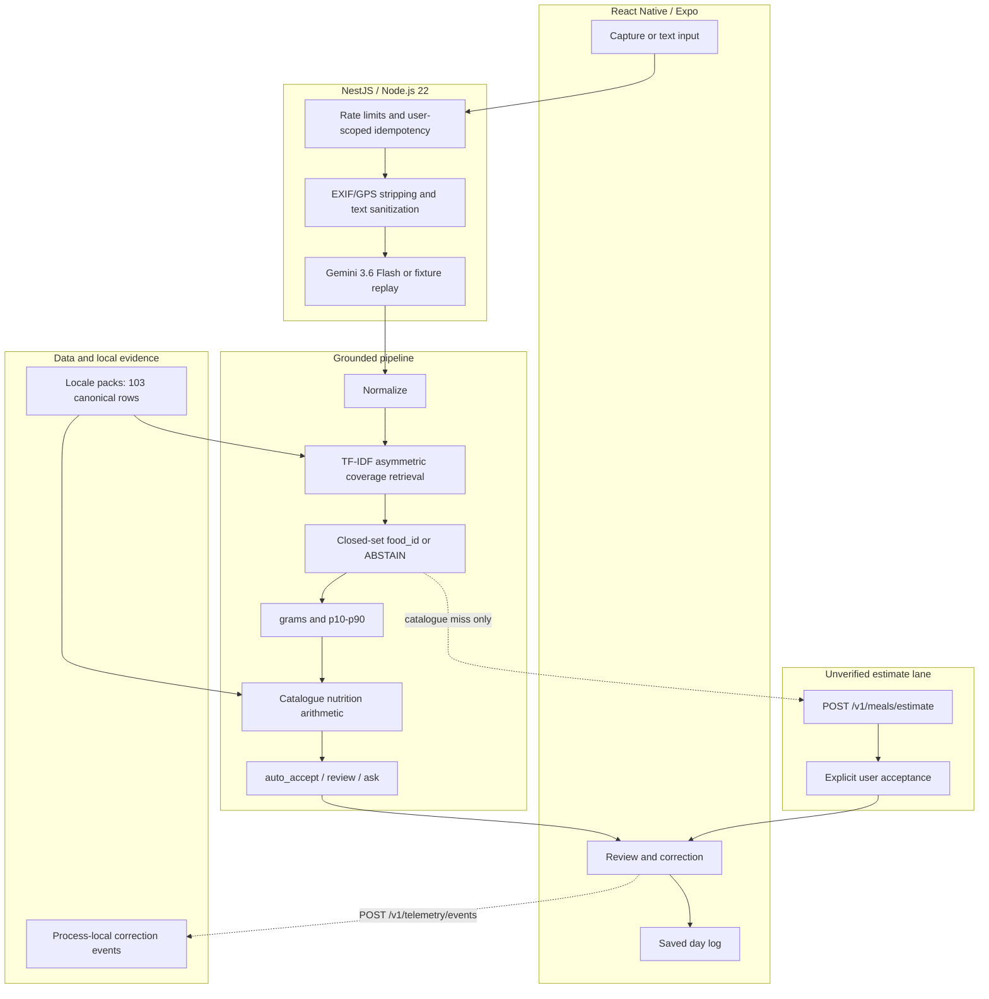
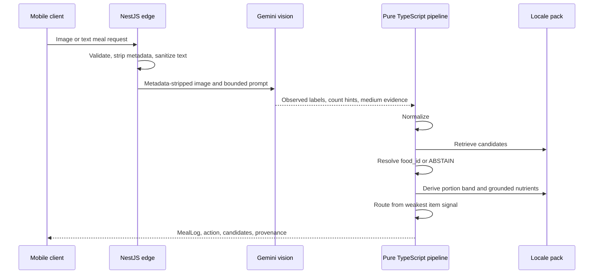

# Mealog technical architecture

This document describes the shipped system and its evidence boundaries. It
separates the grounded nutrition pipeline from the optional unverified estimate
lane, and correction telemetry from any future training system.

## 1. System topology

The grounded lane implements D1: the vision model observes food descriptions;
catalogue rows and deterministic arithmetic produce nutrition. D19 and D20 add
a separate fallback after `ABSTAIN`. That fallback returns broad model-generated
ranges and assumptions labelled `llm_unverified_estimate`. It is never
auto-accepted and is excluded from grounded evaluation.

## 2. Grounded seven-stage pipeline

| Stage | Responsibility | Boundary |
|---|---|---|
| Perception | Observed labels, count hints, capture medium | Grounded path rejects model nutrient fields |
| Normalize | Case, diacritic and unit normalization | Locale behavior comes from packs, not locale branches |
| Retrieve | Word and character TF-IDF with IDF-weighted asymmetric query coverage | Negative aliases cap known confusions below acceptance |
| Resolve | Canonical `food_id` or `ABSTAIN` | No generated food IDs |
| Portion | `grams`, `grams_p10`, `grams_p90`, source and provenance | Missing evidence widens uncertainty or asks for count |
| Nutrition | Catalogue values multiplied by resolved mass | Only grounded nutrition producer |
| Gate | `auto_accept`, `review`, or `ask` | Routes on the weakest identity, portion, count and medium signal |

The current `AUTO_ACCEPT` threshold is `0.75`, not a product-wide promise by
itself. `effectiveConfidence` takes the minimum of identity, portion and count
confidence. Degraded responses force `review`; non-real capture media and
`ABSTAIN` force `ask`; missing quantity forces `review`.

## 3. Messy-input and safety handling

- Multi-item perception is resolved item by item; one unsafe item gates the meal.
- Turkish diacritics, informal quantities and misspellings are normalized before
  word/character retrieval.
- Negative aliases contain known dangerous neighbours, including cooked-versus-
  dry and regional-food confusions. They are measured guards, not proof that the
  whole category is solved.
- Portion uncertainty remains visible as a p10-p90 band. A point estimate alone
  is not sufficient evidence for automatic acceptance.
- `screen`, `printed`, `toy_or_model` and `unclear` capture media force a question;
  they are never positive food evidence.
- Foods outside the selected locale pack remain `ABSTAIN` in the grounded lane.

## 4. Optional unverified estimate lane

`POST /v1/meals/estimate` exists only for unresolved items after the grounded
lane abstains. It accepts one to twenty items and returns bounded calorie and
macro ranges, assumptions, model ID and `llm_unverified_estimate` provenance.

The endpoint requires `X-User-Id` and `X-Idempotency-Key`. It has per-user
minute/day quotas, a bounded LRU cache, shared in-flight promises, a 20-second
timeout and a circuit breaker after repeated provider failures. A provider,
quota or validation failure returns no invented numeric fallback. The mobile
client must show the estimate as unverified and require explicit acceptance.

This lane improves convenience, not grounded accuracy. Its values are not
catalogue nutrition, not laboratory data and not included in V1-V3 metrics.

## 5. Privacy and security boundary

The active edge path validates bounded image uploads, keeps photo bytes in
memory, strips supported EXIF/GPS/IPTC/comment metadata before provider use,
redacts supported PII patterns from text, and filters prompt-injection text.
Meal photos are not persisted by the service.

`blurFacesInPixelArray` and `detectFaceRegions` are tested pure-TypeScript RGBA
utilities. They are not connected to compressed JPEG/PNG ingestion. Therefore
faces or documents visible in pixels may still reach the provider. D14 records
client-side camera processing or an asynchronous decode/blur/re-encode worker as
future work; metadata stripping is shipped, pixel face masking is not.

## 6. Correction telemetry and future learning

The endpoint and curation script are shipped. Events contain no photos or raw
provider envelopes. The store is process-local and not a durable, multi-instance
training platform; current deletion cannot target one anonymized event because
the user ID is not persisted. Corrections are candidate evidence, not labels.
There is no automatic catalogue update, fine-tuning, shadow deployment or model
promotion.

## 7. Runtime and verification stack

| Subsystem | Technology | Role |
|---|---|---|
| Mobile | React Native / Expo | Native capture, review, abstention and day log |
| API edge | NestJS / Node.js 22 / TypeScript | HTTP contracts, validation, limits, adapters |
| Grounded pipeline | Framework-free TypeScript | Normalize, retrieve, resolve, portion, nutrition, gate |
| Evaluation | Python 3.11 | Offline fixture replay, metrics and parity/regression checks |
| Data | Locale packs | Canonical foods, aliases, units, nutrition source and licence status |
| Tests | Vitest and pytest | Runtime behavior, parity, invariants and regression gates |

Bundle/typecheck and hosted CI are repository evidence. They are not current
device-execution or production-deployment proof.

## 8. Decision index

All binding constraints are in [docs/decisions.md](decisions.md).

- D1-D7: grounded closed-set architecture, evaluation and portion distribution.
- D8: fine-tuning is specified but no model is trained.
- D9-D12: mobile format, provider/eval recording and Node edge/Python harness.
- D13-D14: privacy claim narrowed to shipped metadata/text controls.
- D15-D18: abstention, correction telemetry and human-curated future loop.
- D19-D20: explicit unverified estimate lane and bounded batch execution.
