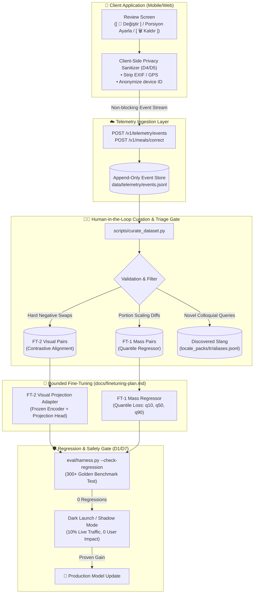

# Mealog Continuous Learning Data Flywheel & HITL Architecture

## 1. Executive Summary

A common failure mode in AI nutrition apps is the **"Static Model Trap"**: a Vision-Language Model (VLM) is deployed, makes mistakes on regional dishes or ambiguous portions, and never improves because user interactions are discarded as transient UI events. Conversely, naively retraining models on raw user submissions results in catastrophic **"Label Poisoning"** (users entering joke dishes, misidentifying beef as lamb, or typing gibberish like `asdfgh`).

Mealog solves this with an enterprise-grade **Active Learning Data Flywheel** governed by a **Human-in-the-Loop (HITL) Curation Pipeline**. User corrections (swapping candidates, adjusting portions, removing spurious items) are captured with strict **Zero-PII sanitization (D4/D5)**, curated through dietetic validation tooling, and used to train bounded projection adapters without ever violating the closed-set anti-hallucination guarantee (**D1**).

---

## 2. End-to-End Flywheel Architecture

---

## 3. The 3 High-Signal Telemetry Streams

| Telemetry Stream | User Action Trigger | ML Objective | Target Model / Artifact |
| :--- | :--- | :--- | :--- |
| **`CANDIDATE_SWAPPED`** | User opens `[ 🔄 Değiştir ]` and selects an alternative (e.g. Model predicted `tr.pilav`, User selected `tr.bulgur_pilavi`). | **Hard Negative Mining:** Teaches the visual adapter to distinguish visually confusable regional foods. | **FT-2 Visual Projection Adapter** |
| **`PORTION_ADJUSTED`** | User adjusts portion slider or piece count (e.g. Model suggested 1 portion (150g), User adjusted to 5 pieces (188g)). | **Quantile Mass Regression:** Calibrates non-linear visual mass estimates against scale ground truths. | **FT-1 Mass Regressor ($q_{10}, q_{50}, q_{90}$)** |
| **`CUSTOM_OVERRIDE`** | User typed a missing regional slang or dish on Abstention screen. | **Vocabulary & Alias Expansion:** Identifies emerging dialect terms without hallucinating IDs. | **`locale_packs/tr/aliases.jsonl`** |

---

## 4. Privacy & Enterprise Governance (D4/D5 & GDPR Article 17)

1. **No Raw Image Storage:** Telemetry records only contain `image_hash` (`sha256`), canonical food IDs, and normalized numeric adjustments. Raw user photos are never committed or saved to database disks.
2. **EXIF & PII Scrubbing:** All metadata, GPS coordinates, and face/biometric data are removed before ingestion.
3. **Right to Be Forgotten:** Supports `DELETE /v1/users/:id/data` (GDPR Article 17) to purge all historical telemetry associations.

---

## 5. Shadow Deployment & Zero-Regression Merge Gate

Before any fine-tuned checkpoint is promoted to production:
1. **Offline Evaluation (`eval/harness.py`):** Must score $\ge$ baseline across all cuisine buckets with **zero regressions**.
2. **Invariant Check (`scripts/check_invariants.py`):** Ensures no nutrient numbers originate outside `pipeline/nutrition.py`.
3. **Shadow Traffic Mode:** Runs asynchronously on 10% of production queries to measure latency and calibration before full rollout.
