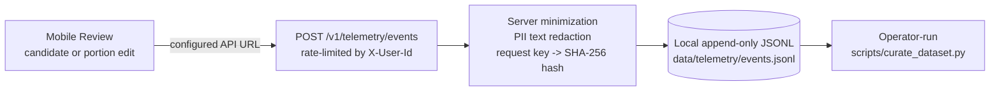
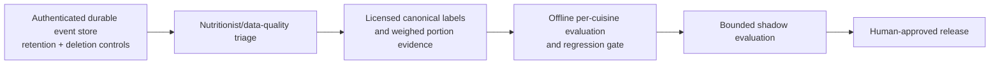

# Mealog correction telemetry and proposed HITL loop

This document separates the **shipped prototype** from a **proposed production
learning loop**. User corrections are useful evidence, but they are not ground
truth and they do not train or promote a model automatically.

## What ships

The delivered behavior is deliberately small:

- The mobile client sends confirmation, candidate-swap, and portion-edit events
  to the same configured API base URL as meal requests. Demo mode sends no
  telemetry.
- The endpoint requires `X-User-Id` for rate limiting but does not persist that
  identifier. The raw idempotency key is replaced by a SHA-256 request hash.
- Free-text telemetry fields pass through the server PII redactor before the
  event is appended. Photos and raw provider envelopes are never telemetry
  fields.
- `scripts/curate_dataset.py` can prepare candidate records for human review.
  Running it is an operator action; its output does not modify locale packs,
  golden labels, or a model automatically. It fails when its telemetry input is
  absent or malformed; it never invents bootstrap events to fill a report.

This is a process-local prototype store, not a lakehouse, durable queue, or
multi-instance event system. Because the stored event has no user identifier,
`DELETE /v1/users/:id/data` clears the user's meal/idempotency state and rate
limit state but cannot address an individual anonymized telemetry row. A
production design needs authenticated pseudonymous ownership, retention limits,
and deletion semantics before telemetry is treated as durable user data.

## Signals, not labels

| Event | Useful signal | Why it is not ground truth |
|---|---|---|
| `CONFIRMED_AS_IS` | The user did not change the proposed result | The user may not have inspected it |
| `CANDIDATE_SWAPPED` | A proposed identity may be wrong | The replacement may also be wrong |
| `PORTION_ADJUSTED` | The proposed mass felt wrong | A visual slider is not a weighed measurement |
| `CUSTOM_OVERRIDE` | Catalogue or vocabulary coverage may be missing | Free text has no nutrient provenance or licence |

D1 still applies: telemetry cannot create nutrient numbers or add a canonical
food. Catalogue changes require licensed source data, human review, and the
existing regression gate.

## Proposed production loop — not shipped

The repository does **not** ship the durable store, nutritionist portal,
automatic fine-tuning, shadow traffic, or model promotion shown above. Those are
next-step architecture, and any future implementation must preserve D1, licence
enforcement, explicit evaluation denominators, and rollback evidence.
