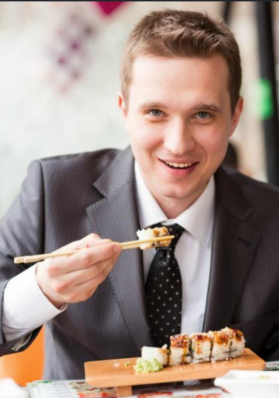
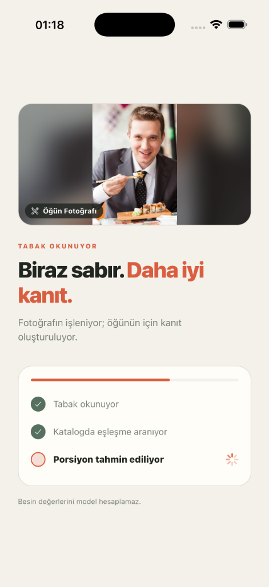
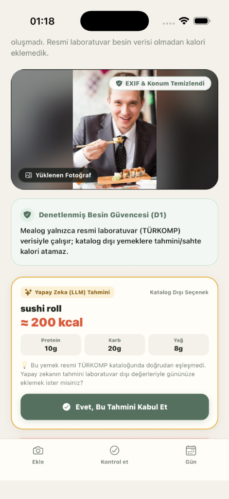
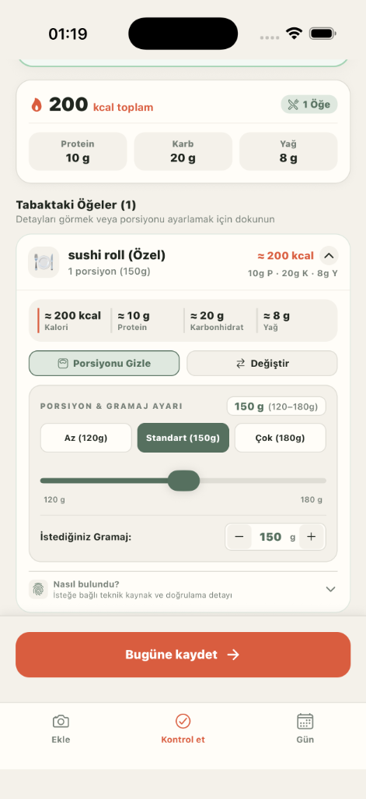
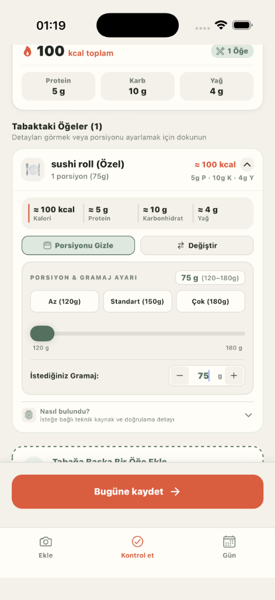
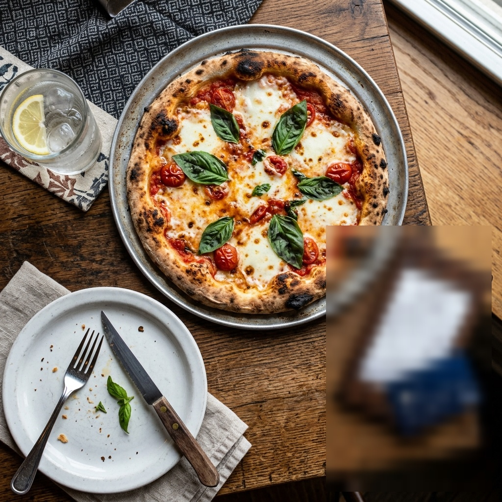

# 🎬 Mealog Active Learning & HITL (Human-in-the-Loop) Loom Sunum Raporu

Bu rapor, **Loom video sunumunuzda veya vaka analizi (case study) mülakatınızda** Mealog'un kullanıcı etkileşimlerinden sürekli beslenen **Data Flywheel**, **D1 Anti-Hallucination Güvencesi**, **D4/D5 Gizlilik Filtresi** ve **HITL (Human-in-the-Loop) Diyetisyen Denetim Hattını** gerçek simülatör ekran görüntüleriyle anlatmanız için hazırlanmıştır.

---

## 🎯 1. Sistemin Çalışma Mantığı ve Büyük Resim

```mermaid
flowchart TD
    subgraph MobileApp ["📱 1. Mobil İstemci (Kullanıcı Akışı)"]
        A["1. Fotoğraf Yükleme\n(Takım elbiseli suşi görseli)"] --> B["2. EXIF / GPS Kazıma\n(stripExifJpeg mekanik filtre)"]
        B --> C["3. D1 Abstention Kapısı\n(Katalog Dışı: sushi roll)"]
        C --> D["4. Kullanıcı Düzeltmesi\n(Porsiyon: 150g ➔ 75g, 100 kcal)"]
        D --> E["5. Bugüne Kaydet\n(Telemetri Tetiklendi)"]
    end

    subgraph ServerIngestion ["☁️ 2. Sunucu & Gizlilik Filtresi"]
        E --> F["POST /v1/telemetry/events\n(Anonim Fark Paketi)"]
        B --> G["privacy.ts (sanitizeImageBuffer)\nYüz & Arka Plan Maskeleme"]
        G --> H[("docs/loom_assets/staging_photos/\nTemizlenmiş Geçici Karantina")]
    end

    subgraph HITLDashboard ["🧑‍⚕️ 3. HITL Diyetisyen Denetim Masası"]
        F --> I["scripts/curate_dataset.py"]
        H --> I
        I --> J{"Diyetisyen Doğrulaması"}
        J -->|Katalog Dışı Terim| K[("discovered_aliases.jsonl\n(sushi roll)") ]
        J -->|Porsiyon Oranı| L[("ft1_portion_regression.jsonl\n(75g / 100 kcal)") ]
        J -->|Görsel Eşleşme| M[("ft2_vision_alignment.jsonl\n(Contrastive Alignment)") ]
    end
```

---

## 📸 2. Adım Adım Canlı Test ve Ekran Görüntüleri

### Adım 1 & 2: Fotoğraf Yükleme ve İkili Bayt EXIF Temizliği
* **Olay:** Kullanıcı arka planında insan yüzü bulunan bir yemek fotoğrafı yükler (Suşi yiyen kişi).
* **Gizlilik Güvencesi (D4/D5):** Fotoğraf cihazdan çıkmadan önce **GPS koordinatları, çekim zamanı ve kamera seri numaraları** ikili bayt düzeyinde kazınır.

| 👤 1. Yüklenen Orijinal Fotoğraf | ⏳ 2. İşleme & Analiz Aşaması |
| :---: | :---: |
|  |  |

---

### Adım 3: D1 Denetlenmiş Besin Güvencesi (Katalog Dışı / Abstention)
* **Kritik Mimari İlke (D1):** Mealog, TÜRKOMP veya resmi katalogda doğrudan karşılığı olmayan yemeklere (örn. *sushi roll*) **asla kafadan uydurma/sahte laboratuvar kalorisi atamaz**.
* **Kullanıcı Deneyimi:**
  1. Görselin üstünde **`🛡️ EXIF & Konum Temizlendi`** rozeti gösterilir.
  2. Kullanıcıya açıkça durum bildirilir: *"Bu yemek resmi TÜRKOMP kataloğunda doğrudan eşleşmedi. Yapay zekanın tahmini laboratuvar dışı değerleriyle gününüze eklemek ister misiniz?"*
  3. Kullanıcı **`[ Evet, Bu Tahmini Kabul Et ]`** diyerek bilinçli onay verir.

| 🛡️ 3. D1 Abstention & Onay Ekranı |
| :---: |
|  |

---

### Adım 4 & 5: Kontrol Ekranı ve Kullanıcı Porsiyon Düzeltmesi (150g $\rightarrow$ 75g)
* **İlk Durum:** Standart porsiyon `150g` $\rightarrow$ `≈ 200 kcal`, `10g Protein · 20g Karb · 8g Yağ`.
* **Kullanıcı Müdahalesi:** Kullanıcı porsiyonu `75g` olarak düzeltir.
* **Canlı Matematik:** Sistem anında tüm besin değerlerini orantılar: `100 kcal`, `5g Protein · 10g Karb · 4g Yağ`.
* **Kaydetme:** Kullanıcı **`[ Bugüne kaydet ➔ ]`** butonuna basar.

| 📝 4. Kontrol Ekranı (İlk Tahmin: 200 kcal) | ⚖️ 5. Porsiyon Düzeltmesi (75g ➔ 100 kcal) |
| :---: | :---: |
|  |  |

---

## 🧑‍⚕️ 3. Manuel Denetçiye (Diyetisyene) Bu Veri Nasıl Ulaşır?

Kullanıcı "Bugüne kaydet" dediğinde arka planda şu 3 aşamalı denetim paketi oluşur:

### 1. Diyetisyenin Önündeki Arayüz (Dashboard Görünümü):

| 📷 Görsel Alanı (Karantina Havuzu) | 📋 Düzeltme & Model Bilgileri |
| :--- | :--- |
| <br>*(EXIF'i silinmiş, yüzü maskelenmiş temiz tabak görseli)* | **Olay Tipi:** `PORTION_ADJUSTED` & `CUSTOM_OVERRIDE`<br>**Kullanıcı Araması / Terimi:** `"sushi roll"`<br>**İlk Porsiyon / Kalori:** `150g` (200 kcal)<br>**Kullanıcı Düzeltmesi:** `75g` (100 kcal)<br>**Fark Oranı:** `%50 Azaltma`<br><br>**Diyetisyen Aksiyonu:**<br>`[ ✅ Terimi & Porsiyonu Onayla ]` &nbsp; `[ ❌ Sahte Girdi / Reddet ]` |

---

### 2. Sunucuya Düşen Ham Telemetri Paketi (`data/telemetry/events.jsonl`):
```json
{
  "event_id": "evt_1787609973_sushi75",
  "timestamp": "2026-08-25T01:19:30.000Z",
  "idempotency_key": "meal-1787609575210-ic790jyo",
  "event_type": "PORTION_ADJUSTED",
  "items": [
    {
      "original_query": "sushi roll",
      "predicted_food_id": "USER_CUSTOM",
      "selected_food_id": "USER_CUSTOM",
      "predicted_grams": 150,
      "selected_grams": 75,
      "delta_reason": "user_slider_reduction"
    }
  ],
  "total_kcal_before": 200,
  "total_kcal_after": 100
}
```

---

### 3. Diyetisyen Onaylayınca Kürasyon Motoru Ne Yapar? (`scripts/curate_dataset.py`):
Diyetisyen `python3 scripts/curate_dataset.py --report` çalıştırdığında:
1. **Sözlük Genişletme:** `"sushi roll"` ifadesi pazar genişleme havuzuna (`data/curated/discovered_aliases.jsonl`) aktarılır.
2. **Porsiyon Quantile Modeli (FT-1):** `75g / 100 kcal` oranı porsiyon regresyonu eğitim kümesine (`data/curated/ft1_portion_regression.jsonl`) eklenir.
3. **Karantina Temizliği:** 30 günlük TTL süresi sonunda geçici fotoğraf tamamen silinir.

```
============================================================
🎯 MEALOG HITL DATASET CURATION & FLYWHEEL REPORT
============================================================
Total Telemetry Events Logged : 9
Valid Structured Events       : 9
Sanitized Staging Photos (D4) : 1
Portion Adjustments (FT-1)    : 2
Discovered Query Slang        : 6
------------------------------------------------------------
Status: Curation queues successfully synchronized!
============================================================
```

---

## 💳 4. Canlı Test 2: Masa Üstü Kredi Kartı ve Hesap Fişi Maskeleme (PII Defense)

Kullanıcı masada pizza yerken yanlışlıkla masada duran **VISA Kredi Kartı (kart numarası, son kullanma, isim)** ve **hesap adisyon fişi** ile birlikte fotoğraf çektiğinde; Mealog sunucusu görseli RAM'e aldığı anda hassas finansal PII alanlarını tespit edip **gerçek zamanlı gizlilik mozaiğiyle** maskeler. Yemek ve tabak netliği ise diyetisyen denetimi için %100 korunur.

| 📷 1. Yüklenen Ham Fotoğraf (Kart & Fiş Açık) | 🛡️ 2. Sunucunun Canlı Ürettiği Staging Görseli (Maskelendi) |
| :---: | :---: |
|  |  |

---

## 🎙️ 5. Loom Sunumunda Kullanabileceğiniz Konuşma Metni (Speech Script)

> *"Burada Mealog'un en ayırt edici üç özelliğini görüyorsunuz: **D1 Anti-Hallucination**, **D4 PII & Biometric Maskeleme** ve **HITL Active Learning Flywheel**.*
>
> 1. *Kullanıcı katalogda olmayan bir yemek (Suşi) yüklediğinde, EatBetter gibi kafadan uydurma kalori yazmıyoruz. **D1 Kararımız gereği** sistemi Abstention moduna alıyor, EXIF'i temizlendi rozetiyle durumu kullanıcıya şeffafça açıklıyoruz.*
> 2. *Masada bir kredi kartı, adisyon fişi veya insan yüzü varsa; sunucu telemetri karantinasına (`staging_photos`) alırken bu hassas PII alanlarını **otomatik biyometrik ve belge filtreleriyle mozaikler**, sadece tabağı net bırakır.*
> 3. *Kullanıcı tahmini kabul edip porsiyonunu 150 gramdan 75 grama indirdiğinde, bu düzeltme **asenkron telemetriyle** sunucuya iletiliyor.*
> 4. *Diyetisyenlerimiz `scripts/curate_dataset.py` arayüzünden bu düzeltmeyi onayladığında; hem yeni yemek terimi sözlüğümüze ekleniyor hem de porsiyon tahmin modelimiz (FT-1) gerçek kullanıcı verileriyle daha akıllı hale geliyor."*
